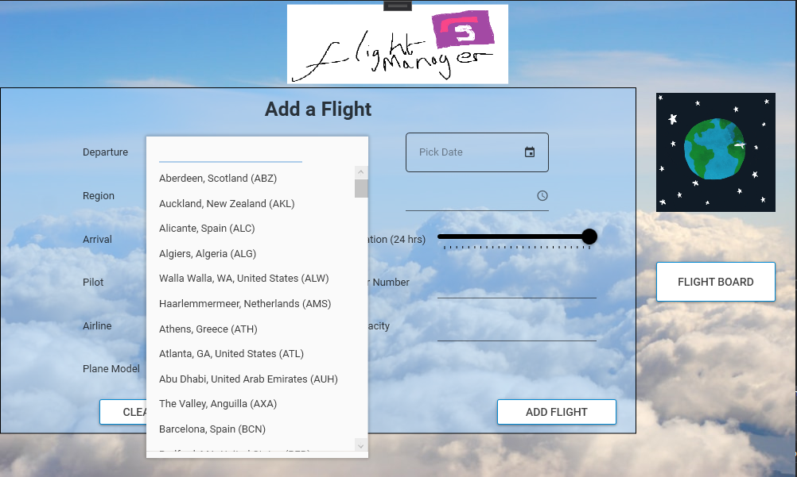
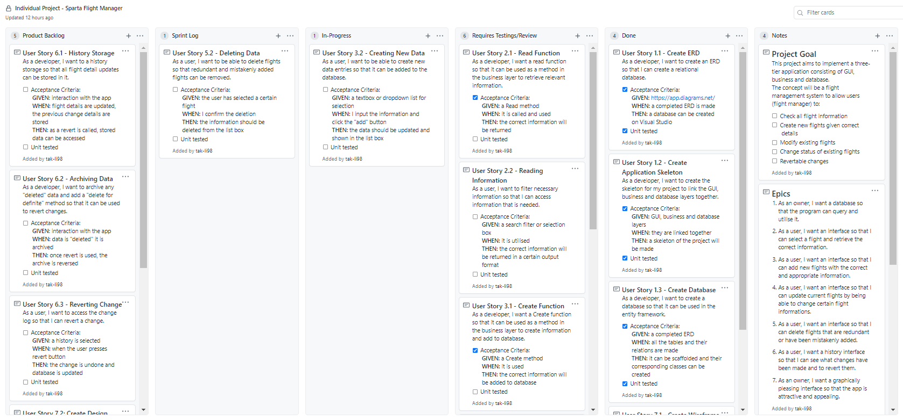

# Project Progress - Sparta Flight Manager

[TOC]

## Introduction

Imagine you are one with the world and you want to be able to see which flights are departing and arriving from one country to another. 

You want to be able to change certain flight details; delay or cancel a flight, change the pilot or change the destination.

This project does just that!

The project aims to provide an 3-tier application (GUI, Manager, Database) to allow  to manage flights.

The main features of the application would be to:

1. Display all flights on a 'flight board'
2. Create a new flight allowing users to select airline, airports, pilots, plane, date
3. Modify existing flight details 
4. Delete or cancel any existing flights
5. Flight statuses such as scheduled, depart/arrived can be auto-determined through date check

6. (Extra feature if enough time): Change reversion option through use of a history logger

### <u>Sprint 0</u>

| Epics |                                                              |
| :---: | ------------------------------------------------------------ |
|   1   | As an owner, I want a database so that the program can query and utilise it. |
|   2   | As a user, I want an interface so that I can select a flight and retrieve the correct information. |
|   3   | As a user, I want an interface so that I can add new flights with the correct and appropriate information. |
|   4   | As a user, I want an interface so that I can update current flights by being able to change certain flight information. |
|   5   | As a user, I want an interface so that I can delete flights that are redundant or have been mistakenly added. |
|   6   | As a user, I want a history interface so that I can see what changes have been made and to revert them. |
|   7   | As an owner, I want a graphically pleasing interface so that the app is attractive and appealing. |

### User Story Definition of Done

- Acceptance criteria has been met 
- User story has been reviewed and tested

### Project Definition of Done
- [ ] All requirements for any given page have been fulfilled according to the Epics

- [ ] No unnecessary wastage of interface space

- [ ] All necessary unit testing has been created and passes without any fails

- [ ] Documentation has been fully prepared: README instructs how to use program, SCRUM board for each sprint has been shown, notes of where class diagrams are, overall project retrospective

- [ ] Interface design follows a defined standard

- [ ] Project published and .exe can be run and used as expected 

-------------------------------

## <u>Sprint 1</u>

#### Sprint Goal

| User Story ID | Title                       | Description                                                  |
| ------------- | --------------------------- | ------------------------------------------------------------ |
| 1.1           | Create ERD                  | As a developer, I want to create an ERD so that I can create a relational database |
| 1.2           | Create Application Skeleton | As a developer, I want to create the skeleton for my project to link the GUI, business and database layers together. |
| 1.3           | Create Database             | As a developer, I want to create a database so that it can be used in the entity framework. |
| 7.1           | Create Wireframe            | As a developer, I want a wireframe so that I can know how the GUI would look like. |

#### Sprint Start Board:

#### ERD:

#### Sprint End Board:

#### Sprint Review

| Tasks Done                        | Notes                                                        |
| --------------------------------- | ------------------------------------------------------------ |
| 1.1 -  Create ERD                 | - Used Draw.io - Added all classes, their fields and corresponding relationship with one another |
| 1.2 - Create Application Skeleton | - Created three projects under the 'SpartaFlightManager' solution of: GUI, Manager & Database |
| 1.3 - Create Database             | - Made queries to create tables and insert data into them (saved into a folder for future use) - Added dummy data in all the classes - Converted database into classes through scaffolding - Made a test method to retrieve the relevant information and print to console an example format of: "Flight: BA032; departing from London, England (LHR) on 2021/08/03 15:00:00 arriving at Beijing, China (BJS)." |

| Tasks Not Done         | Actions                                                      |
| ---------------------- | ------------------------------------------------------------ |
| 7.1 - Create Wireframe | - To be done in a later sprint right before developing the GUI layer |

#### Sprint Retrospective

| What went well                                               | Improvements                                                 | Actions                                     |
| ------------------------------------------------------------ | ------------------------------------------------------------ | ------------------------------------------- |
| - Created the required database and inserted appropriate amount of example data | - To commit work more often                                  | - Add User Story 7.1 to the Product Backlog |
| - Documentation all sorted for other sprints                 | - To write documentation along with work to prevent recalling the sprint tasks and writing at the end of the sprint |                                             |
| - Documentation style is clear and concise                   | - Double check work to see if it is correct and follows standards to ensure it doesn't affect future work to much if it *is* wrong |                                             |

------------------

## <u>Sprint 2</u>

#### Sprint Goal

| User Story ID | Title               | Description                                                  |
| ------------- | ------------------- | ------------------------------------------------------------ |
| 2.1           | Read Function       | As a developer, I want a read function so that it can be used as a method in the business layer to retrieve relevant information. |
| 2.2           | Reading Information | As a user, I want to filter necessary information so that I can access information that is needed. |
| 3.1           | Create Function     | As a developer, I want a Create function so that it can be used as a method in the business layer to create information and add to database. |
| 4.1           | Update Function     | As a developer, I want a update function so that the method can be used to update data in the database. |
| 5.1           | Delete Function     | As a developer, I want a delete function so that any wrong data can be removed from the database. |

#### Sprint Start Board:

#### Demo

- MainWindow: When user selects a flight and presses "Full Details" button...

- FullDetailsWindow: Flight details are shown given the flight ID

#### Sprint End Board

#### Sprint Review

| Tasks Done             | Notes                                                        |
| ---------------------- | ------------------------------------------------------------ |
| 2.1 - Read Function    | - Added a 'Retrieve' method for all the three manager classes (Flight, Flight Details and Pilot) - Added a specific method in Flight Manager to return a formatted list given information from multiple tables |
| 2.2 - Read Information | - Created a basic GUI to allow users to select from a View List, press for more details, full details show in another window |
| 3.1 - Create Function  | - Added a 'Create' method which adds data into specific tables, with auto incrementing IDs |
| 4.1 - Update Function  | - Added an 'Update' method to take in existing IDs and update the corresponding table data |
| 5.1 - Delete Function  | - Added a 'Delete' method to delete any data corresponding to the ID given |

| Tasks Not Done        | Actions                 |
| :-------------------- | ----------------------- |
| 2.1 - Read Function   | - Add more unit testing |
| 3.1 - Create Function | - Add more unit testing |
| 4.1 - Update Function | - Add more unit testing |
| 5.1 - Delete Function | - Add more unit testing |

#### Sprint Retrospective

| What went well                                               | Improvements                                                 | Actions                                                      |
| ------------------------------------------------------------ | ------------------------------------------------------------ | ------------------------------------------------------------ |
| - Created the necessary foundation in the manager classes to be used by GUI | - Write cleaner code                                         | - Add more unit testing for all the methods created in each manager class |
| - Finished tasks set for sprint (excluding the unit tests)   | - Speed up the sprint progress and not spend all night on it | - Refactor some parts of code to be more "clean"             |
| - Started a GUI to visualise how the app will be like        |                                                              |                                                              |

-----------------------------

### <u>Sprint 3</u>

#### Sprint Goal

| User Story ID | Title             | Description                                                  |
| ------------- | ----------------- | ------------------------------------------------------------ |
| 3.2           | Creating New Data | As a user, I want to be able to create new data entries so that it can be added to the database. |
| 4.2           | Modifying Data    | As a user, I want to be able to retrieve the correct flight information so that I can modify it. |
| 5.2           | Deleting Data     | As a user, I want to be able to delete flights so that redundant and mistakenly added flights can be removed. |
| 7.1           | Create Wireframe  | As a developer, I want a wireframe so that I can know how the GUI would look like, |

#### Sprint Start Board:

#### Tasks Completed

During this sprint, a numerous of tasks were completed, these included:

- Wireframe was completed
- Main, 'Flight Details' and 'Add Flights' window created which allows for users to select a flight and update some flight details.

#### Wireframe:

#### Demo:

- Mainwindow:

- Flight Details Window:

- Add Flights Window:

#### Sprint End Board:

#### Sprint Review

| Tasks Done             | Notes                                                        |
| ---------------------- | ------------------------------------------------------------ |
| 4.2 - Modifying Data   | - Flight details are modified in the 'Flight details' window |
| 7.1 - Create Wireframe | - Wireframe for each window created in Draw.io               |

| Tasks Not Done          | Actions                  |
| :---------------------- | ------------------------ |
| 3.2 - Creating New Data | - To be done next sprint |
| 5.2 - Delete Data       | - To be done next sprint |

#### Sprint Retrospective

| What went well                                               | Improvements                       | Actions                                                      |
| ------------------------------------------------------------ | ---------------------------------- | ------------------------------------------------------------ |
| - Created GUI resembling wireframe                           | - Need to write unit tests         | - Add more unit testing for all the methods created in each manager class |
| - GUI functions well with business layer                     | - Comment code to be more readable | - Add create and delete functions                            |
| - Dynamic airline combo list and region text depending on departure |                                    |                                                              |

-----------------------------------------

### <u>Sprint 4</u>

#### Sprint Goal

| User Story ID | Title               | Description                                                  |
| ------------- | ------------------- | ------------------------------------------------------------ |
| 2.2           | Reading Information | As a user, I want to filter necessary information so that I can access information that is needed. |
| 3.2           | Creating New Data   | As a user, I want to be able to create new data entries so that it can be added to the database. |
| 5.2           | Deleting Data       | As a user, I want to be able to delete flights so that redundant and mistakenly added flights can be removed. |

#### Sprint Start Board:

#### Sprint End Board:

#### Sprint Review

| Tasks Done                | Notes                                                        |
| ------------------------- | ------------------------------------------------------------ |
| 2.2 - Reading Information | - Made windows for the plane, airline and airports which retrieves and displays the correct info |
|                           |                                                              |

| Tasks Not Done            | Actions                                     |
| :------------------------ | ------------------------------------------- |
| 2.2 - Reading Information | - Add a pilots window                       |
| 3.2 - Creating New Data   | - Add create pilot function in pilot window |
| 5.2 - Delete Data         | - Allow pilots to be deleted                |

#### Sprint Retrospective

| What went well                                       | Improvements               | Actions                                                      |
| ---------------------------------------------------- | -------------------------- | ------------------------------------------------------------ |
| - Creating windows that are consistent with that app | - Need to write unit tests | - Add more unit testing for all the methods created in each manager class |
| - Utilising business layer well to shorten code      |                            | - Add a pilot window with create and delete functions        |

----------------------------------

### <u>Sprint 5</u>

#### Sprint Goal

| User Story ID | Title               | Description                                                  |
| ------------- | ------------------- | ------------------------------------------------------------ |
| 2.2           | Reading Information | As a user, I want to filter necessary information so that I can access information that is needed. (For Pilot Window) |
| 3.2           | Creating New Data   | As a user, I want to be able to create new data entries so that it can be added to the database. (For Pilot Window) |
| 5.2           | Deleting Data       | As a user, I want to be able to delete flights so that redundant and mistakenly added flights can be removed. (For Pilot Window) |

#### Sprint Start Board:

#### Sprint End Board:

#### Sprint Review

| Tasks Done                | Notes                               |
| ------------------------- | ----------------------------------- |
| 2.2 - Reading Information | - Made windows for the pilot window |
| 3.2 - Creating New Data   | - Can create a new pilot            |
| 5.2 - Delete Data         | - Can delete a pilot                |

| Tasks Not Done                               | Actions                                                      |
| :------------------------------------------- | ------------------------------------------------------------ |
| 3.2 Creating New Data - Adding profile photo | - Find a way to display the image in the app - Allow for non-resource images to be used in app |

#### Sprint Retrospective

| What went well                                   | Improvements                             | Actions                                                      |
| ------------------------------------------------ | ---------------------------------------- | ------------------------------------------------------------ |
| - Pilot window is simple and functions as needed | - Need to make adding profile photo work | - Find solution to add profile picture and have it show up in the list |

----------------------------------

### <u>Sprint 6</u>

#### Sprint Goal

| User Story ID | Title                   | Description                                                  |
| ------------- | ----------------------- | ------------------------------------------------------------ |
| 7.2           | Create Design Standards | As a developer, I want a design standard so that the interface is consistent throughout. |
| 7.3           | Create Design Features  | As a developer, I want graphically pleasant icons and interface objects so that it can liven up the app. |

#### Sprint Start Board:

#### Demo:

- Loading Screen:

- Main Window:

  

- Add Flight Window:

- Flight Details Window:

- Airlines Window:

- Planes Window:

- Pilots Window:

#### Sprint End Board:

#### Sprint Review

| Tasks Done                   | Notes                                                        |
| ---------------------------- | ------------------------------------------------------------ |
| 7.3 - Create Design Features | - Created app logo, window header texts - Added a loading screen |

| Tasks Not Done                | Actions                                                      |
| :---------------------------- | ------------------------------------------------------------ |
| 7.2 - Create Design Standards | - None (Not necessary as design throughout app has been consistent without a written standard) |

#### Sprint Retrospective

| What went well                              | Improvements                   | Actions                         |
| ------------------------------------------- | ------------------------------ | ------------------------------- |
| - Adding a loading screen with sound effect | - Even more outstanding design | - Fix up the pilot photo adding |
| - Every window linked to each other well    |                                |                                 |

-----------------------

### Overall Project Retrospective

