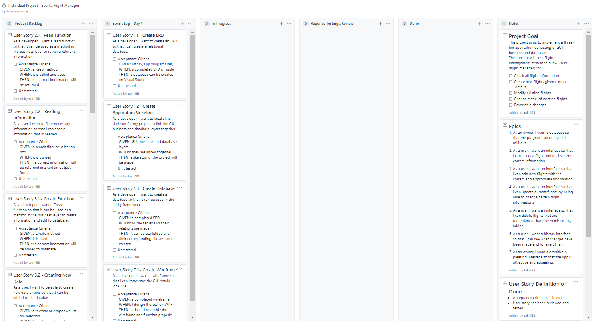

# Project Progress - Sparta Flight Manager

## Introduction

This project aims to provide an 3-tier application (GUI, Manager, Database) to allow users to manager flights.

(Add more here later)

### <u>Sprint 0</u>

| Epics |                                                              |
| :---: | ------------------------------------------------------------ |
|   1   | As an owner, I want a database so that the program can query and utilise it. |
|   2   | As a user, I want an interface so that I can select a flight and retrieve the correct information. |
|   3   | As a user, I want an interface so that I can add new flights with the correct and appropriate information. |
|   4   | As a user, I want an interface so that I can update current flights by being able to change certain flight information. |
|   5   | As a user, I want an interface so that I can delete flights that are redundant or have been mistakenly added. |
|   6   | As a user, I want a history interface so that I can see what changes have been made and to revert them. |
|   7   | As an owner, I want a graphically pleasing interface so that the app is attractive and appealing. |

### User Story Definition of Done

- Acceptance criteria has been met 
- User story has been reviewed and tested

### Project Definition of Done
- [ ] All requirements for any given page have been fulfilled according to the Epics

- [ ] No unnecessary wastage of interface space

- [ ] All necessary unit testing has been created and passes without any fails

- [ ] Documentation has been fully prepared: README instructs how to use program, SCRUM board for each sprint has been shown, notes of where class diagrams are, overall project retrospective

- [ ] Interface design follows a defined standard

- [ ] Project published and .exe can be run and used as expected 

-------------------------------

### <u>Sprint 1</u>

#### Sprint Goal

| User Story ID | Title                       | Description                                                  |
| ------------- | --------------------------- | ------------------------------------------------------------ |
| 1.1           | Create ERD                  | As a developer, I want to create an ERD so that I can create a relational database |
| 1.2           | Create Application Skeleton | As a developer, I want to create the skeleton for my project to link the GUI, business and database layers together. |
| 1.3           | Create Database             | As a developer, I want to create a database so that it can be used in the entity framework. |
| 7.1           | Create Wireframe            | As a developer, I want a wireframe so that I can know how the GUI would look like. |

#### Sprint Start Board:

#### ERD:

#### Sprint End Board:

#### Sprint Review

| Tasks Done                        | Notes                                                        |
| --------------------------------- | ------------------------------------------------------------ |
| 1.1 -  Create ERD                 | - Used Draw.io - Added all classes, their fields and corresponding relationship with one another |
| 1.2 - Create Application Skeleton | - Created three projects under the 'SpartaFlightManager' solution of: GUI, Manager & Database |
| 1.3 - Create Database             | - Made queries to create tables and insert data into them (saved into a folder for future use) - Added example data in all the classes - Converted database into classes through scaffolding - Made a test method to retrieve the relevant information and print to console an example format of: "Flight: BA032; departing from London, England (LHR) on 2021/08/03 15:00:00 arriving at Beijing, China (BJS)." |

| Tasks Not Done         | Actions                                                      |
| ---------------------- | ------------------------------------------------------------ |
| 7.1 - Create Wireframe | - To be done in a later sprint right before developing the GUI layer |

#### Sprint Retrospective

| What went well                                               | Improvements                                                 | Actions                                     |
| ------------------------------------------------------------ | ------------------------------------------------------------ | ------------------------------------------- |
| - Created the required database and inserted appropriate amount of example data | - To commit work more often                                  | - Add User Story 7.1 to the Product Backlog |
| - Documentation all sorted for other sprints                 | - To write documentation along with work to prevent recalling the sprint tasks and writing at the end of the sprint |                                             |
| - Documentation style is clear and concise                   |                                                              |                                             |

------------------

### <u>Sprint 2</u>

#### Sprint Goal

#### Sprint Review

- List of backlog items "done", actions for any items not "done"

#### Sprint Retrospective

- what went well, improvements and action plan

-----------------------------

### <u>Sprint 3</u>

#### Sprint Goal

#### Sprint Review

- List of backlog items "done", actions for any items not "done"

#### Sprint Retrospective

- what went well, improvements and action plan

-----------------------------------------

### <u>Sprint 4</u>

#### Sprint Goal

#### Sprint Review

- List of backlog items "done", actions for any items not "done"

#### Sprint Retrospective

- what went well, improvements and action plan

----------------------------------

### <u>Sprint 5</u>

#### Sprint Goal

#### Sprint Review

- List of backlog items "done", actions for any items not "done"

#### Sprint Retrospective

- what went well, improvements and action plan

----------------------------------

### <u>Sprint 6</u>

#### Sprint Goal

#### Sprint Review

- List of backlog items "done", actions for any items not "done"

#### Sprint Retrospective

- what went well, improvements and action plan

