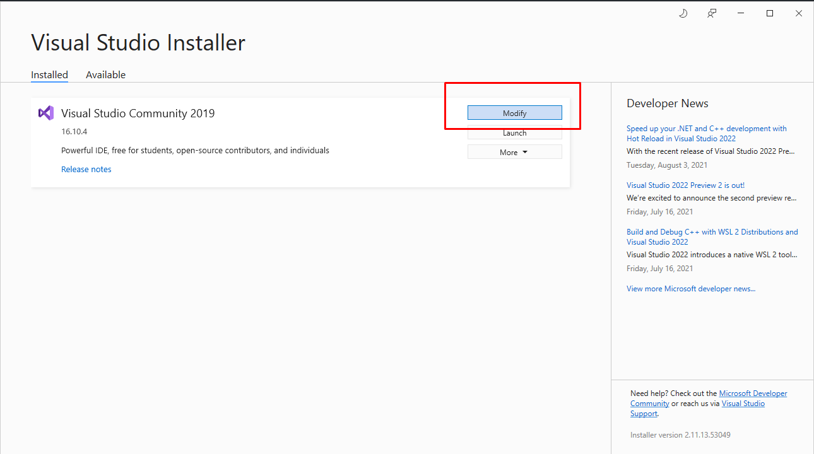
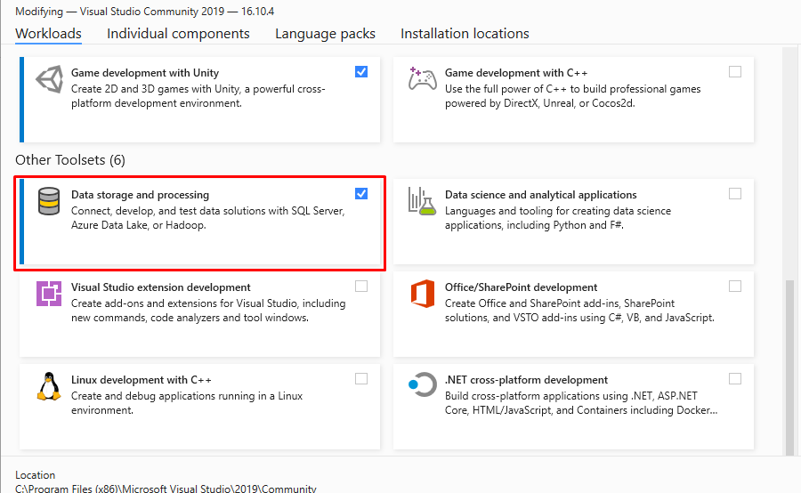
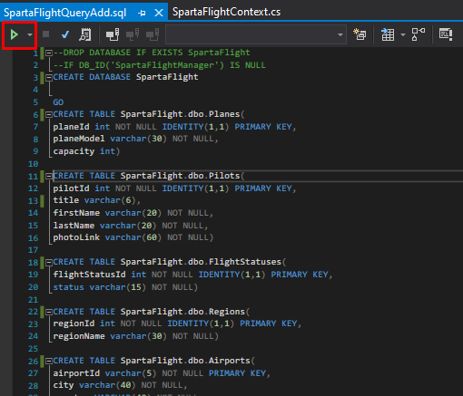
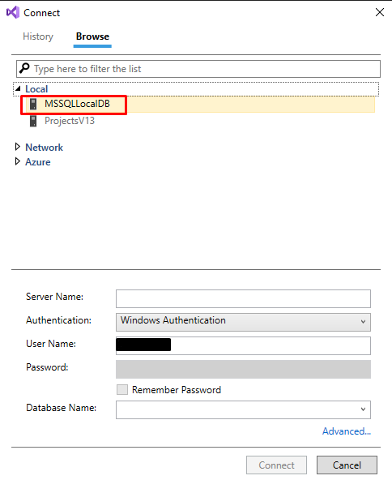
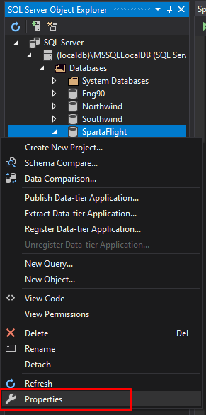
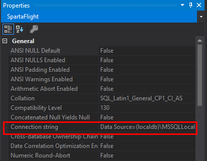
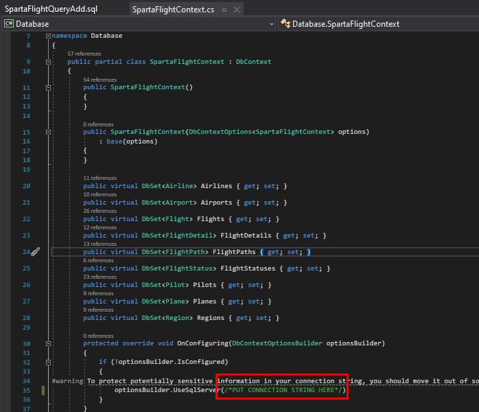

# Sparta Flight Manager README

Welcome onboard Sparta Flight Manager! 

In this README there will be instructions on how to setup the app on your local computer so that you can run it!

-------------------------------

Before you start make sure you have 'Data storage and processing' installed

##### Step 1: Open Visual Studio Installer &#8594; Press Modify

##### Step 2: Scroll down and install 'Data storage and processing' toolset (make sure to close Visual Studio if you have it open already)

##### Step 3: In Visual Studio, File &#8594; Open &#8594; File... &#8594; Open 'SpartaFlightQueryAdd.sql' (Located in \SpartaFlightManager\SpartaFlightManager\Queries) and run it

##### Step 4: A connection prompt will pop up, Local &#8594; MSSQLLocalDB &#8594; Connect. 

Press run again if it does not automatically run upon returning from the connection prompt.

##### Step 5: Open up the SQL Server Object Explorer (can be found in the search bar) 

SQL Server &#8594; (localdb)\MSSQLLocalDB &#8594; Databases &#8594; 'SpartaFlight' &#8594; Expand the database and then right click and click 'Properties'

##### Step 6: Copy the Connection String

##### Step 7: Copy the string into line 35 of 'SpartaFlightContext.cs' (found in the Database project folder)
Remember to put @ in front of " " quotes to make '\\' not an escape character!

##### Step 8: You can now run the application! Make sure the start up project is set to 'GUI'.

##### Step 9: You can now find the executable file in the release folder

 It should be stored here: \SpartaFlightManager\SpartaFlightManager\GUI\bin\Release\net5.0-windows

-----------------------------

**Thank you for using my application and I hope you enjoy it!**

